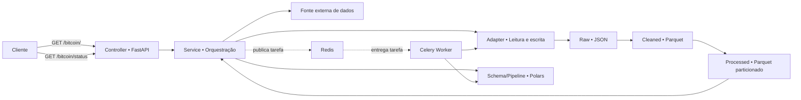

# Bitcoin Lakehouse API

<p align="center">
  Pipeline de dados para coleta, transformação, armazenamento e consulta do histórico de mercado do Bitcoin.
</p>

<p align="center">
  
  
  
  
  
  
  
</p>

## Sobre o projeto

O **Bitcoin Lakehouse API** é uma aplicação de engenharia de dados que coleta dados históricos de mercado, aplica transformações com Polars e disponibiliza os resultados por meio de uma API FastAPI.

Os dados percorrem três camadas inspiradas na **Medallion Architecture**:

- **Raw:** preserva a resposta original em JSON.
- **Cleaned:** armazena dados tipados e tratados em Parquet.
- **Processed:** organiza os dados para consulta e os particiona por data.

O processamento e a persistência das camadas podem ser executados de forma assíncrona por um worker Celery, utilizando Redis como broker e backend de resultados.

## Principais recursos

- Coleta de dados de uma fonte externa configurável.
- Processamento lazy e colunar com Polars.
- Armazenamento em JSON e Apache Parquet.
- Particionamento da camada processada por data.
- Consulta completa ou filtrada por ano, mês e dia.
- Tarefas assíncronas com Celery e Redis.
- Documentação automática com OpenAPI.
- Logs em inglês no terminal e em arquivo.
- Execução conteinerizada com Docker Compose.

## Arquitetura



Nenhum endereço da fonte externa é exposto pela API ou por este documento. A integração é definida exclusivamente pela configuração do ambiente.

### Componentes

| Componente | Responsabilidade |
|---|---|
| `scr/CONTROLLER` | Inicializa o FastAPI, define as rotas e encaminha requisições. |
| `scr/SERVICE` | Decide qual camada ler, executa o pipeline e inicia tarefas Celery. |
| `scr/SCHEMA` | Reúne operações reutilizáveis sobre `LazyFrame`. |
| `scr/INFRA` | Carrega configurações e integra a aplicação com a fonte externa e o Redis. |
| `scr/ADAPTER` | Controla leitura, escrita e particionamento de JSON e Parquet. |
| `scr/LOGS` | Configura a saída de logs no terminal e em arquivo. |

## Fluxo de uma consulta

1. O cliente chama a rota `GET /bitcoin/`.
2. O serviço procura primeiro a camada `processed`.
3. Se necessário, procura as camadas `cleaned` e `raw`.
4. Quando não há dados locais, o serviço consulta a fonte externa configurada.
5. O pipeline converte tipos, cria a coluna `Date`, ordena os registros e calcula a variação percentual.
6. Uma tarefa Celery persiste as camadas ausentes em segundo plano.
7. A API devolve os registros processados em JSON e, quando aplicável, o identificador da tarefa.
8. O cliente pode consultar a tarefa pela rota `GET /bitcoin/status`.

## Estrutura do projeto

```text
LAKE HOUSE/
├── scr/
│   ├── ADAPTER/
│   │   ├── DATABASE/
│   │   └── STORAGE/
│   │       ├── RAW/
│   │       ├── CLEANED/
│   │       └── PROCESSED/
│   ├── CONTROLLER/
│   ├── INFRA/
│   │   ├── CONNECT/
│   │   └── CORE/
│   ├── LOGS/
│   ├── SCHEMA/
│   └── SERVICE/
├── docker-compose.yaml
├── dockerfile
├── requirements.txt
└── README.md
```

## Tecnologias

| Tecnologia | Uso no projeto |
|---|---|
| Python | Linguagem principal. |
| FastAPI | Rotas HTTP e documentação OpenAPI. |
| Polars | Limpeza, tipagem, filtros e cálculos. |
| Apache Parquet | Armazenamento colunar das camadas tratadas. |
| Celery | Execução das tarefas assíncronas. |
| Redis | Broker e backend de resultados. |
| Requests | Comunicação com a fonte externa. |
| Docker Compose | Orquestração da API, worker e Redis. |

## Pré-requisitos

### Com Docker

- Docker Engine ou Docker Desktop.
- Docker Compose v2.

### Execução local

- Python 3.14.
- Redis disponível.
- Variáveis de ambiente configuradas.

## Configuração

A aplicação utiliza três variáveis:

| Variável | Finalidade |
|---|---|
| `BROKER` | Conexão usada pelo broker do Celery. |
| `BACKEND` | Conexão usada para os resultados do Celery. |
| `URL` | Fonte externa privada dos dados históricos. |

Configure essas variáveis em `scr/INFRA/CORE/.env` ou diretamente no ambiente. O README não inclui valores ou endereços reais.

```env
BROKER=<celery-broker>
BACKEND=<celery-result-backend>
URL=<external-data-source>
```

A fonte externa deve retornar registros com a estrutura esperada pelo pipeline:

```text
open_time, open, high, low, close, volume, close_time,
quote_asset_volume, number_of_trades, taker_buy_base_volume,
taker_buy_quote_volume, ignore
```

> Nunca versione credenciais, tokens ou endereços privados no repositório.

## Como executar com Docker

Na raiz do projeto, construa a imagem:

```bash
docker build -t api_lakehouse -f dockerfile .
```

Inicie a API, o worker e o Redis:

```bash
docker compose up -d
```

Verifique os serviços:

```bash
docker compose ps
```

Acompanhe os logs:

```bash
docker compose logs -f
```

Encerre o ambiente:

```bash
docker compose down
```

## Como executar localmente

Crie o ambiente virtual:

```bash
python -m venv .venv
```

Ative no Windows PowerShell:

```powershell
.\.venv\Scripts\Activate.ps1
```

Instale as dependências:

```bash
pip install -r requirements.txt
```

Com o Redis iniciado, abra um terminal para o worker:

```bash
python -m celery -A scr.INFRA.manager:app worker --pool=solo --loglevel=info
```

Abra outro terminal para a API:

```bash
python -m uvicorn scr.CONTROLLER.main:app --host 0.0.0.0 --port 8000 --reload
```

## Rotas

O projeto expõe somente as rotas abaixo:

| Método | Rota | Descrição |
|---|---|---|
| `GET` | `/bitcoin/` | Retorna os dados disponíveis e inicia a persistência quando necessário. |
| `GET` | `/bitcoin/?filter=year&field={year}` | Filtra os registros por ano. |
| `GET` | `/bitcoin/?filter=month&field={month}` | Filtra os registros por mês. |
| `GET` | `/bitcoin/?filter=day&field={day}` | Filtra os registros pelo dia do mês. |
| `GET` | `/bitcoin/status?id={task_id}` | Consulta uma tarefa assíncrona. |
| `GET` | `/docs` | Abre a documentação Swagger UI. |
| `GET` | `/redoc` | Abre a documentação ReDoc. |
| `GET` | `/openapi.json` | Retorna o contrato OpenAPI. |

### Consulta completa

```http
GET /bitcoin/
```

### Consultas filtradas

```http
GET /bitcoin/?filter=year&field=2025
GET /bitcoin/?filter=month&field=6
GET /bitcoin/?filter=day&field=15
```

Os parâmetros aceitos são:

| Parâmetro | Valores | Descrição |
|---|---|---|
| `filter` | `year`, `month`, `day` | Define qual parte da data será comparada. |
| `field` | Número correspondente | Informa o ano, mês ou dia procurado. |

### Consulta de tarefa

Use o `task_id` retornado pela consulta:

```http
GET /bitcoin/status?id={task_id}
```

### Estrutura geral da resposta

```json
{
  "task_id": "task-identifier",
  "data": [
    {
      "Date": "2025-01-01",
      "open": 93425.1,
      "high": 94910.2,
      "low": 92700.0,
      "close": 94419.5,
      "percent": 1.06
    }
  ]
}
```

## Logs

Os logs são exibidos em inglês no terminal e gravados em:

```text
LOGS/app.log
```

Exemplo:

```text
2026-07-04 12:00:00 | INFO | scr.SERVICE.pipeline | Running the cleaned-layer transformation pipeline...
```

As mensagens de integração não exibem a fonte externa, o endereço do broker ou o endereço do backend.

## Persistência

| Camada | Formato | Conteúdo |
|---|---|---|
| `RAW` | JSON | Resposta original da fonte externa. |
| `CLEANED` | Parquet | Dados convertidos e tratados. |
| `PROCESSED` | Parquet | Dados preparados para consulta e particionados por `Date`. |

Para produção, recomenda-se compartilhar o armazenamento entre API e worker por meio de volume ou armazenamento de objetos compatível com S3.

## Próximas melhorias

- [ ] Adicionar testes unitários e de integração.
- [ ] Validar os parâmetros com modelos Pydantic.
- [ ] Adicionar timeout e retry à coleta externa.
- [ ] Compartilhar o armazenamento entre API e worker.
- [ ] Retornar um objeto serializável no endpoint de status.
- [ ] Adicionar health checks para API, worker e Redis.
- [ ] Automatizar lint, testes e build com CI/CD.

---

<p align="center">
  Construído com Python, FastAPI, Polars, Celery e Redis.
</p>
